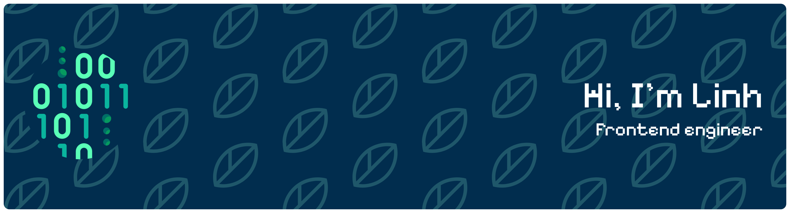

### 🛠️ Tech Stack

---

### 🚀 Projects
I’m currently working on Meal Planner App 🫐: plan meals, manage groceries, and explore AI-powered recipe suggestions. 
Github link will be public after my first deployment and features will be added by sprints. 
I'm doing agile/scrum for this (Yes! even on my personal project). 

---

### 🌱 Currently Learning
- Dive in JS/TS/React/Next  
- CI/CD pipelines with Docker + AWS  
- Algorithms & data structures
- NestJS (trying to write blogs to share what I learned)
- A bit of cybersecurity daily

---

### 📫 How to reach me:
[LinkedIn](https://linkedin.com/in/yourprofile) · [Email](mailto:linh.lkl@outlok.com)
